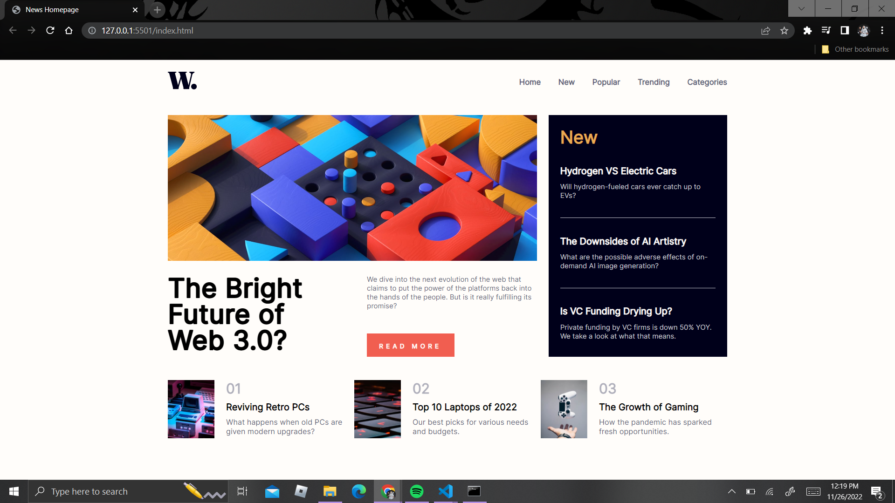

# Frontend Mentor - News homepage solution

This is a solution to the [News homepage challenge on Frontend Mentor](https://www.frontendmentor.io/challenges/news-homepage-H6SWTa1MFl). Frontend Mentor challenges help you improve your coding skills by building realistic projects. 

## Table of contents

- [Overview](#overview)
  - [The challenge](#the-challenge)
  - [Screenshot](#screenshot)
  - [Links](#links)
- [My process](#my-process)
  - [Built with](#built-with)
  - [What I learned](#what-i-learned)
  - [Continued development](#continued-development)
  - [Useful resources](#useful-resources)

&nbsp;

## Overview

### **The challenge**

Users should be able to:

- View the optimal layout for the interface depending on their device's screen size
- See hover and focus states for all interactive elements on the page
- **Bonus**: Toggle the mobile menu (requires some JavaScript)

&nbsp;

### **Screenshot**
This is a screenshot of my solution.

&nbsp;

### **Links**

- Solution URL: [Project Solution](https://github.com/crawler990/newspage)
- Live Site URL: [News HomePage](https://crawler990.github.io/newspage/)

&nbsp;

## **My process**

### **Built with**

- HTML5
- CSS custom properties
- CSS Grid and Flex
- Mobile-first workflow
- Javascript

&nbsp;

### **What I learned** 

This is/was my very first project doing any kind of frontend work. I had previously only majored in backend development which I have done for the past 2 years and felt comfortable with yet always felt intimidated by frontend development since I felt I didn't particularly know enough to be good at it.

I took this as a challenge and realized that although it isn't a walk in the park, it isn't the end of the world either. I enjoyed the process of learning new things, even basic things, which helped me understand the mind of a frontend developer. I learned how to use **CSS Grid** and **Flex** for layout and how it just makes everything so much easier. CSS Grid in particular is very powerful and a game changer when it comes to responsive builds and complex layouts.

Learning how to visualize a design in terms of the layout and understanding exactly what is needed is a skill I intend to work on and I believe every frontend developer should develop.

&nbsp;

### **Continued development**

I am very new to frontend development and just only getting started. I am going to learn a lot in this journey understanding CSS and HTML better, Javascript for HTML development and learn Javascript frameworks like React, Vue and Angular. This should be FUN!

&nbsp;

### **Useful resources**

- [FlexBox Froggy](https://flexboxfroggy.com/) - This helped me understand flexbox and how it works in an easy and fun way through a simple little game. The entire walkthrough takes about 20 mins and should be worth your time if you're struggling with flex.

- [Traversy Media](https://www.youtube.com/watch?v=0xMQfnTU6oo) - If you're more of a visual learner like me and understand better by watching, then I'd recommend watching this video on CSS Grid by Traversy Media. I have personally gained a lot from watching his YouTube channel for the entirety of my relatively young development career as he explains many different programing technologies and concepts well and why things work how they work.

- [StackOverflow](https://stackoverflow.com/questions/2941189/how-to-overlay-one-div-over-another-div) - Obviously, stackoverflow. This is probably the gratest tool as a developer to use and you will undoubtedly meet similar people online with similar issues as to the ones you might be facing. Be keen and ensure you understand your problem well and you'll be able to find a solution or get ideas on how to sort your problem.

